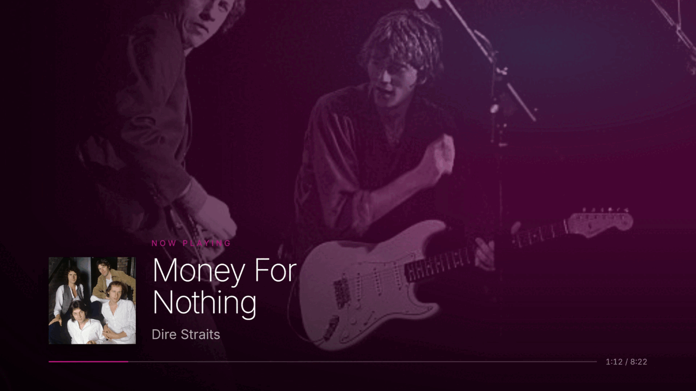
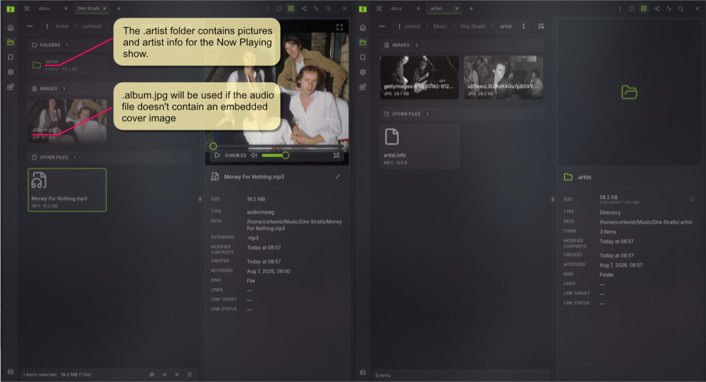

# Sigma File Manager — Linux / Wayland fork

A fork of [aleksey-hoffman/sigma-file-manager](https://github.com/aleksey-hoffman/sigma-file-manager),
originally created and maintained by [Aleksey Hoffman](https://github.com/aleksey-hoffman).

**This fork is Linux-only, and no longer builds on Windows or macOS at all.** It is developed
and tested under Wayland with Sway, and coded for that environment. Nothing here has been
tested on any other platform.

The break is not incidental: the native media stack (`audio_covers`, `media_info`) links
GStreamer, which is declared as a Linux-only dependency, while the modules themselves are not
gated — so compilation fails on both other platforms. Repairing it would mean maintaining code
this fork does not ship, run or test, so CI does not attempt those builds and releases are
Linux only. The `#[cfg(windows)]` and macOS code still in the tree is inherited from upstream
and is now entirely unverified; treat it as such. X11 paths are likewise inherited and not
exercised.

The fork has diverged far enough that it is not intended to be merged back.

For the feature list, screenshots and community links, see the upstream README.

## Requirements

- **Rust** — stable toolchain
- **Node** — 24.16.0 or newer
- System libraries, below

### Arch

```bash
sudo pacman -S --needed base-devel rust nodejs npm \
  webkit2gtk-4.1 gtk3 librsvg libayatana-appindicator \
  gstreamer gst-plugins-base gst-plugins-good gst-libav
```

GStreamer is needed at build *and* run time: video thumbnails and embedded audio cover art go
through it. `gst-plugins-good` and `gst-libav` supply the decoders for common formats — without
them the app still builds and runs, but video thumbnails fail.

Optional:

```bash
sudo pacman -S patchelf      # only to build AppImage/deb bundles
sudo pacman -S wl-clipboard  # only to run the clipboard tests
```

### Debian / Ubuntu

```bash
sudo apt install -y \
  libwebkit2gtk-4.1-dev libjavascriptcoregtk-4.1-dev \
  libayatana-appindicator3-dev librsvg2-dev patchelf \
  libgstreamer1.0-dev libgstreamer-plugins-base1.0-dev \
  gstreamer1.0-plugins-good gstreamer1.0-libav
```

On Ubuntu 24.04, pin WebKitGTK to `2.44.0-2` — later builds throw `EGL_BAD_PARAMETER` at
runtime. See `.github/actions/install-linux-tauri-deps` for the exact pinned set CI uses.

## Setup

```bash
npm install
```

## Development build

```bash
npm run tauri:dev
```

Starts Vite and opens the app with hot reload. If WebKit renders a blank or black window on
your GPU, try:

```bash
npm run tauri:dev:webkit-igpu
```

### Debugging the file picker

The file dialogs other applications open through the desktop portal are served by dedicated
picker processes (see `docs/standalone-processes.md`), so `npm run tauri:dev` alone never
shows one. To run a picker against the dev server with the Web Inspector attached:

```bash
# Terminal 1 — the dev server only (use tauri:dev instead to also get the main window)
npm run dev

# Terminal 2 — a debug binary with devtools, launched straight into picker mode
cargo build --features devtools --manifest-path src-tauri/Cargo.toml
./src-tauri/target/debug/sigma-file-manager --file-picker '{"title":"Dev picker","currentFolder":"/tmp"}'
```

The dialog opens together with a Web Inspector window — the `devtools` cargo feature
auto-opens it for picker processes, which matters because right-click → Inspect is disabled
app-wide. Hot reload works normally; the page comes from the dev server.

The payload is the same JSON the portal backend passes. Every field is optional, and a
missing or malformed payload still opens a default open-file dialog:

```json
{
  "title": "Save Firmware Image",
  "save": true,
  "suggestedName": "firmware.bin",
  "currentFolder": "/home/user/Downloads",
  "multiple": false,
  "directory": false,
  "filters": [
    { "name": "Images", "globs": ["*.png", "*.jpg"], "mimes": ["image/*"] },
    { "name": "All Files", "globs": ["*"], "mimes": [] }
  ],
  "currentFilter": "Images"
}
```

`save` brings the filename field and the two-step replace confirmation, `directory` picks
folders, `multiple` allows Ctrl-click multi-select, and `filters` populates the type dropdown
in the footer — handy since reaching save or directory mode through a real application's
dialog is awkward.

Worth knowing while iterating:

- Confirming or cancelling **ends the process**: the answer goes to stdout as
  `{"uris": [...]}`, which is exactly how the portal backend consumes a real dialog.
  Relaunch to iterate.
- The dialog reads your real user settings — layout, hidden files, theme, accent.
- The virtualized listing reads its row heights (the `--file-picker-*-height` custom
  properties) once at mount, so changing them live in the Inspector moves the boxes but not
  the scroll math. Edit the source instead and let hot reload re-read them coherently.

## Release build

> Publishing a version is a different thing from building one locally, and is done by CI —
> see [`docs/releasing.md`](docs/releasing.md) for the tag-to-published-release steps.

```bash
npx tauri build --no-bundle
```

Builds the frontend and the optimised binary, and skips packaging. The result is:

```
src-tauri/target/release/sigma-file-manager
```

Install it wherever you keep local binaries:

```bash
install -Dm755 src-tauri/target/release/sigma-file-manager ~/.local/bin/sigma-file-manager
```

### Rebuilding only the Rust side

When the frontend has not changed, this is much faster:

```bash
cargo build --release --features tauri/custom-protocol --manifest-path src-tauri/Cargo.toml
```

**`--features tauri/custom-protocol` is required.** Without it Tauri builds the binary in dev
mode: it starts, but loads the frontend from `http://localhost:1420` instead of its embedded
assets, and the window shows `Could not connect to localhost: Connection refused`. The `tauri`
CLI passes this feature itself, which is why it only has to be given when calling `cargo`
directly.

## Bundles (AppImage / deb)

Only needed to produce distributables. **Requires `patchelf`** — `linuxdeploy`'s GStreamer
plugin shells out to it, and without it the bundle fails.

```bash
npm run tauri:build:linux
```

**Use this exact script — not `npm run tauri:build` or `npx tauri build`.** The `:linux`
variant sets `NO_STRIP=true`, and that is load-bearing: `linuxdeploy` ships its own old
`strip`, which cannot parse the `.relr.dyn` sections in modern Arch libraries and fails on
every library it touches (`unknown type [0x13] section '.relr.dyn'`). `NO_STRIP` skips
stripping entirely.

Produces both, under `src-tauri/target/release/bundle/`:

```
appimage/Sigma File Manager_2.2.0_amd64.AppImage
deb/Sigma File Manager_2.2.0_amd64.deb
```

No other setup is needed. In particular `APPIMAGE_EXTRACT_AND_RUN=1` is *not* required — Tauri
already passes `--appimage-extract-and-run` to `linuxdeploy`, so its own libfuse2 dependency
never comes into play — and the output directory does not need clearing between runs, because
each run replaces it. For that reason, do not run two builds at once: the second wipes the
first one's AppImage.

Tauri reports every bundling failure as the same generic `failed to run linuxdeploy`,
regardless of cause. **Re-run with `--verbose`** to see the real error — it is the only
practical way to diagnose this step.

## Tests and checks

```bash
npm run test:unit:run                                   # frontend unit tests
cargo test --manifest-path src-tauri/Cargo.toml --lib   # Rust tests
npm run check                                           # types + lint + unit tests
```

The clipboard tests in `src-tauri/src/system_clipboard/files.rs` talk to the real compositor.
They skip themselves unless `WAYLAND_DISPLAY` is set, and they need `wl-clipboard`. While they
run, they take over the system clipboard.

## Linux notes

- **Cut / copy with other file managers** works on Wayland: the clipboard carries
  `x-special/gnome-copied-files` and KDE's `application/x-kde-cutselection` alongside
  `text/uri-list`. On X11 the fallback offers `text/uri-list` only, so a cut made in another
  application is read as a copy.
- **The app quits when its last visible window closes.** The main window and Quick View can
  each outlive the other; only the absence of both ends the process. A single hook,
  `should_keep_running_without_windows` in `src-tauri/src/lib.rs`, is where anything that
  should outlive the windows would register.
- **Debugging a blank window:** run with `WEBKIT_DISABLE_DMABUF_RENDERER=1`. On AMD + Wayland,
  WebKit sometimes fails to composite its own error page, so a real error can show as plain
  white.

## Now Playing show

Fullscreen audio takes over the screen when you stop touching the machine, in the manner of the
old Zune desktop software: artist photography with a slow pan, metadata thrown across the frame
in capitals, and a color wash that drifts through the Zune palette. Any movement or keypress
hands the screen straight back.



The original pulled its photography and biographies from Microsoft's servers, which is why the
feature died with the service. This one reads a folder you fill yourself, so there is nothing to
shut down.

### Folder layout

Put a `.artist` folder beside the audio. `artist` without the dot works too, matched without
regard to case, so the folder can stay hidden or not as you prefer.



The track folder is on the left above, the `.artist` folder opened on the right. The folder is
looked for **beside the track first, then one level up**, so an `Artist/Album/track.mp3` tree can
keep a single `.artist` folder at the artist level and have every album under it use the same
photography.

Inside it:

- **Images** — `jpg`, `jpeg`, `png`, `webp`, `avif` or `gif`, any names you like, as the two
  photographs are on the right above. They are used as backdrops in name order, so number them
  if the order matters.
- **`artist.info`** — the text. Any other `*.info` file is used if this one is absent.

The **album cover** is separate from the `.artist` folder and comes from the track's own
embedded artwork first, falling back to an image beside the track named `cover`, `folder`,
`album`, `albumart` or `artist`, with or without a leading dot, in `jpg`, `jpeg`, `png` or
`webp`. That is what `.album.jpg` is doing on the left above.

Nothing is mandatory. With no `.artist` folder at all the show still runs from the file name,
reading `Artist - Title.mp3`, using the album cover as its backdrop.

### `artist.info`

The format is deliberately whatever you get from selecting a Wikipedia infobox and pressing
copy, because that is what people actually do:

```
Single by Dire Straits
from the album Brothers in Arms
B-side	"Love over Gold" (Live)
Released	28 June 1985[1]
Studio	AIR (Salem, Montserrat)
Genre	Pop rock
Length	
8:22 (album version)
7:04 (LP edit)
Label	Vertigo
Songwriters	
Mark KnopflerSting
```

Which means all of the following are handled:

- `Key<TAB>Value` on one line.
- A key with an **empty** value whose entries continue on the lines below it, as `Length` does.
- Citation markers such as `[1]`, which are stripped.
- List items that arrived concatenated, as `Mark KnopflerSting` does — split at the
  lowercase-to-uppercase seam, with name particles like `McCartney` and `DeVito` left alone.
  Writing one value per line avoids the guesswork entirely.
- `Key: value` instead of tabs, for hand-written files. A leading `8:22` is still read as a
  value, not as a key called `8`.
- Lines before the first key, including `Single by …` and `from the album …`, which is where the
  artist and album come from. Anything else there becomes an "About" card.

Recognised keys are `artist`, `title`, `album`, `released`, `label`, `genre`, `b-side`,
`songwriters`, `producers`, `studio` and `length`, with common synonyms. Note that **ID3 tags are
not read for any of this** — files pulled off the web routinely have none at all, which is why
the sidecar and the file name are the sources.

### Watching it

Open an audio file in Quick View (<kbd>Space</kbd>) or select it with the info panel open, then
press the **fullscreen button in the player**, and leave the machine alone for ten seconds.

**Use the player's own fullscreen control, not the compositor's.** The show keys off the page
being in fullscreen; making the *window* fullscreen with a Sway binding leaves the page unaware,
and the countdown never starts.

If the album cover is missing from the show but the file is there, restart the app: a directory
with no cover in it is remembered for the lifetime of the process, so artwork added to a folder
you have already browsed stays invisible until then.

Timings live at the top of `src/components/ui/media-player/now-playing-show.vue`, and the
ten-second delay is `SHOW_IDLE_MS` in `media-player.vue`.

## License

GNU GPLv3, unchanged from upstream. See [LICENSE.md](LICENSE.md).
